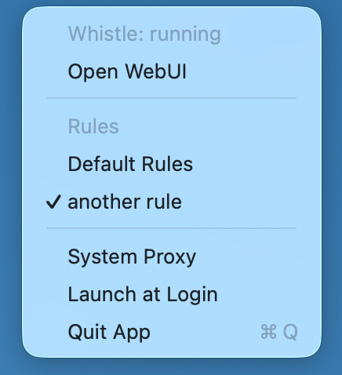

# Whistle Menubar


一个 macOS 菜单栏常驻小工具，用于快速查看和操作本机默认 Whistle 实例。

Whistle Menubar 不显示 Dock 图标或主窗口。它只和本机 `127.0.0.1:8899` 上的 Whistle WebUI、`w2` 命令以及 macOS 系统代理设置交互。

<p align="center">
  
</p>

## 功能

- 菜单栏常驻，展示 Whistle 当前状态。
- Whistle 停止时可通过菜单执行 `w2 restart` 启动服务。
- 打开默认 WebUI：`http://127.0.0.1:8899`。
- 读取 Whistle Rules CGI，展示 Default Rules 和普通 Rules。
- 自动开启 Whistle Rules 多选模式。
- 点击 Rule 后通过 CGI 启用或停用，多个 Rules 可同时启用。
- 通过 `w2 proxy` / `w2 proxy 0` 切换系统代理。
- 通过 `scutil --proxy` 读取 macOS 真实系统代理状态。
- 使用 `SMAppService.mainApp` 控制开机启动。
- 操作失败时发送系统通知。
- 菜单和通知文案通过 `Localizable.strings` 本地化。

## 安装

1. 安装并配置 Whistle，确认本机默认实例使用 `127.0.0.1:8899`。
2. 确认 `w2` 命令可用。应用会尝试从 Homebrew、常见 npm global 路径、`command -v w2` 和 npm prefix 中查找。
3. 从 [GitHub Releases](https://github.com/viko16/whistle-menubar/releases) 下载最新的 macOS zip。
4. 解压后将 `whistle-menubar.app` 拖到 `Applications` 或其他你习惯的位置。

Release zip 的架构后缀来自 GitHub Actions runner，例如 `macos-ARM64` 或 `macos-X64`。当前发布流程打包的是 runner 当前架构，不生成 universal binary。

默认发布包使用 ad-hoc codesign。它能保证 bundle 签名结构完整，但不是 Developer ID 签名或公证包。如果 macOS Gatekeeper 阻止首次打开，可以右键应用选择“打开”，或从源码自行构建。

## 要求

- macOS 14.0 或更新版本。
- Swift 5.10+ / Xcode Command Line Tools，用于源码构建。
- 本机默认 Whistle 实例使用 `127.0.0.1:8899`。
- 已安装 `w2`。

## 从源码运行

```bash
./script/run_app.sh
./script/run_app.sh --verify
./script/run_app.sh --logs
```

`script/build_and_run.sh` 仅保留为兼容入口，内部会转到 `script/package_app.sh`，不会启动 App。

## 构建打包

```bash
./script/package_app.sh
```

脚本会：

1. 执行 release 构建：`swift build -c release --product whistle-menubar`。
2. 生成可拷贝的 `dist/whistle-menubar.app`。
3. 写入包含 `LSUIElement = true` 的 `Info.plist`。
4. 复制 app 图标、菜单栏图标和本地化资源。
5. 默认执行 ad-hoc codesign 并验证 bundle 结构。

可选参数：

```bash
./script/package_app.sh --configuration debug
./script/package_app.sh --unsigned
```

如果要使用正式 Developer ID 签名，可以通过环境变量传入签名身份：

```bash
SIGN_IDENTITY="Developer ID Application: Your Name (TEAMID)" ./script/package_app.sh
```

## 隐私与权限

- 应用不会连接外部服务，也不会上传数据。
- 应用会访问本机 `http://127.0.0.1:8899` 的 Whistle Rules CGI。
- 切换 Rules 时，应用会把对应 Rule 名称和值提交给本机 Whistle CGI。
- 应用会运行 `w2 status`、`w2 restart`、`w2 proxy`、`w2 proxy 0` 和 `scutil --proxy`。
- 应用会请求系统通知权限，用于展示操作失败提示。
- 开机启动通过 macOS `SMAppService.mainApp` 注册或取消。
